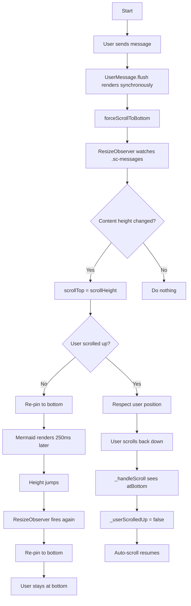
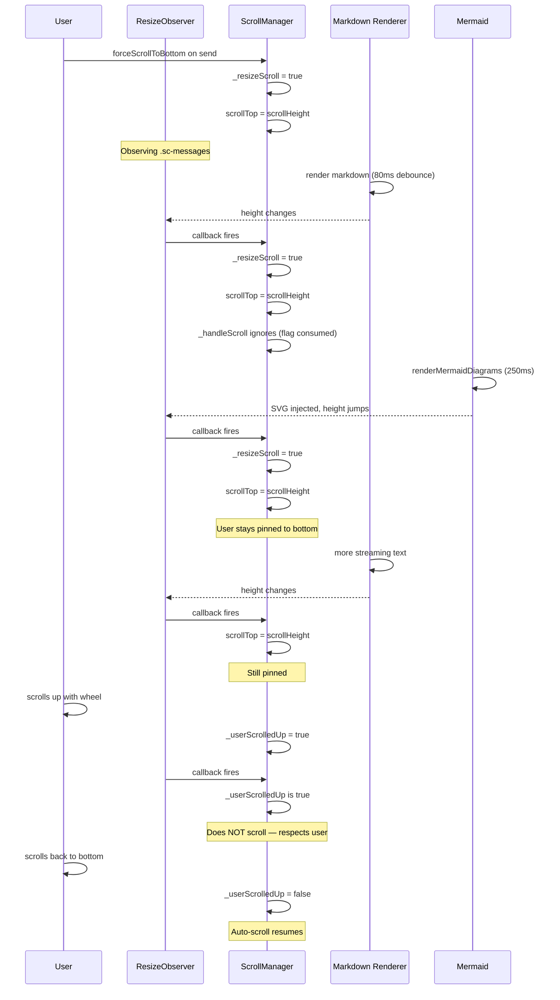
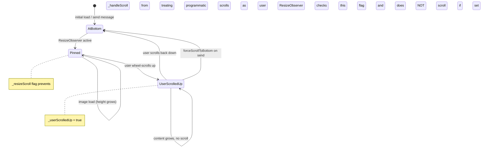
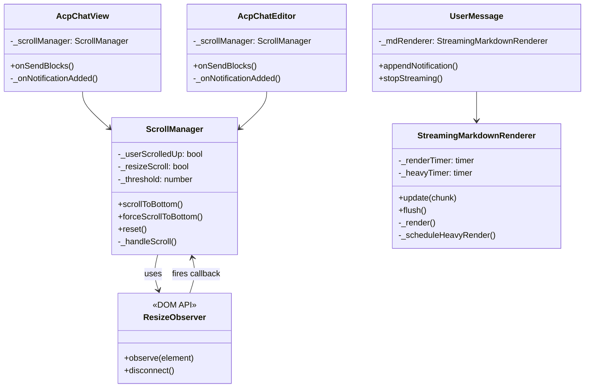

# Scroll Stress Test

## 1. Flowchart — Tall Diagram

```mermaid
flowchart TD
    A[Start] --> B[User sends message]
    B --> C[UserMessage.flush renders synchronously]
    C --> D[forceScrollToBottom]
    D --> E[ResizeObserver watches .sc-messages]
    E --> F{Content height changed?}
    F -->|Yes| G[scrollTop = scrollHeight]
    F -->|No| H[Do nothing]
    G --> I{User scrolled up?}
    I -->|No| J[Re-pin to bottom]
    I -->|Yes| K[Respect user position]
    J --> L[Mermaid renders 250ms later]
    L --> M[Height jumps]
    M --> N[ResizeObserver fires again]
    N --> O[Re-pin to bottom]
    O --> P[User stays at bottom]
    K --> Q[User scrolls back down]
    Q --> R[_handleScroll sees atBottom]
    R --> S[_userScrolledUp = false]
    S --> T[Auto-scroll resumes]
```

## 2. Sequence — Multi-step Rendering

```mermaid
sequenceDiagram
    participant U as User
    participant RO as ResizeObserver
    participant SM as ScrollManager
    participant MD as Markdown Renderer
    participant MM as Mermaid

    U->>SM: forceScrollToBottom on send
    SM->>SM: _resizeScroll = true
    SM->>SM: scrollTop = scrollHeight

    Note over RO: Observing .sc-messages

    MD->>MD: render markdown (80ms debounce)
    MD-->>RO: height changes
    RO->>SM: callback fires
    SM->>SM: _resizeScroll = true
    SM->>SM: scrollTop = scrollHeight
    SM->>SM: _handleScroll ignores (flag consumed)

    MM->>MM: renderMermaidDiagrams (250ms)
    MM-->>RO: SVG injected, height jumps
    RO->>SM: callback fires
    SM->>SM: _resizeScroll = true
    SM->>SM: scrollTop = scrollHeight
    Note over SM: User stays pinned to bottom

    MD->>MD: more streaming text
    MD-->>RO: height changes
    RO->>SM: callback fires
    SM->>SM: scrollTop = scrollHeight
    Note over SM: Still pinned

    U->>U: scrolls up with wheel
    SM->>SM: _userScrolledUp = true
    RO->>SM: callback fires
    SM->>SM: _userScrolledUp is true
    Note over SM: Does NOT scroll — respects user

    U->>U: scrolls back to bottom
    SM->>SM: _userScrolledUp = false
    Note over SM: Auto-scroll resumes
```

## 3. State Machine

```mermaid
stateDiagram-v2
    [*] --> AtBottom: initial load / send message
    AtBottom --> Pinned: ResizeObserver active
    Pinned --> Pinned: markdown render (height grows)
    Pinned --> Pinned: mermaid render (height jumps)
    Pinned --> Pinned: tool view render (height grows)
    Pinned --> Pinned: streaming text (height grows)
    Pinned --> Pinned: image load (height grows)

    Pinned --> UserScrolledUp: user wheel-scrolls up
    UserScrolledUp --> UserScrolledUp: content grows, no scroll
    UserScrolledUp --> AtBottom: user scrolls back down
    UserScrolledUp --> AtBottom: forceScrollToBottom on send

    note right of Pinned: _resizeScroll flag prevents
    _handleScroll from treating
    programmatic scrolls as user scrolls

    note right of UserScrolledUp: _userScrolledUp = true
    ResizeObserver checks this flag
    and does NOT scroll if set
```

## 4. Class Diagram — Architecture

```mermaid
classDiagram
    class ScrollManager {
        -_userScrolledUp: bool
        -_resizeScroll: bool
        -_threshold: number
        +scrollToBottom()
        +forceScrollToBottom()
        +reset()
        -_handleScroll()
    }

    class ResizeObserver {
        <<DOM API>>
        +observe(element)
        +disconnect()
    }

    class StreamingMarkdownRenderer {
        -_renderTimer: timer
        -_heavyTimer: timer
        +update(chunk)
        +flush()
        -_render()
        -_scheduleHeavyRender()
    }

    class UserMessage {
        -_mdRenderer: StreamingMarkdownRenderer
        +appendNotification()
        +stopStreaming()
    }

    class AcpChatView {
        -_scrollManager: ScrollManager
        +onSendBlocks()
        -_onNotificationAdded()
    }

    class AcpChatEditor {
        -_scrollManager: ScrollManager
        +onSendBlocks()
        -_onNotificationAdded()
    }

    ScrollManager --> ResizeObserver: uses
    ResizeObserver --> ScrollManager: fires callback
    UserMessage --> StreamingMarkdownRenderer
    AcpChatView --> ScrollManager
    AcpChatEditor --> ScrollManager
```
