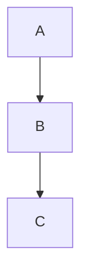

# TO DO

## ACP Chat specific

- ~~Get rid of echo of user message and improper formatting of user response~~
- ~~Change the default color of the text in rich text editor to same white as text in monaco editor. It's dark enough. Just use white text everywhere in the chat, including in the rendered chat. text is far far too dark everywhere in chat.~~
- ~~Model selection in chat~~
- ~~Make all text in chat brighter. it's a dark theme. can barely see text right now. too muted.~~
- ~~Add resume session logic to chat history so you can reload old sessions~~

- Pull thinking tokens out of the weird scrollable box they're in and enable syntax highlighting for their thoughts
- Log to `~/.local/share/crow/acp.log` and find all instances where we still log to some sidex directory to rename to crow
- Add katex to rendering in chat
- Moving off of window should not prevent information streamed from the backend from being displayed. You should be able to move between windows and see response from different chats.
- Moving back to previously viewed window the focus should be on the very bottom of the chat
- Include the session-id once it is selected at the top

### Rich Text Editor

- Give rich text editor for a chat its own URI schema so we can split the rich text editor into a whole other window
- Experiment with seps on a document
- Enable scroll wheel in rich text editor.
- Resizing rich text editor. <- This seems less important if you can split into another window
- Proper syntax highlighting for typst (WYSIWYG?) and good @ context mechanism in the rich text editor.
- When message is sent it shows up as bubble in chat
- Work on highlighting context and adding to rich text editor this is the most crucial.
- Longer term I see user talking in a persistent document with seps that get inserted and the agent response is linked to somehow but we create a document out of it
- This rich text editor should basically be monaco++
- I want full typst syntax highlighting
- I want to be able to save what I was typing in so drafts folder for session/prompt essentially
- Autocomplete with something like zed uses for local model autocomplete

$$ \nabla $$

### Tools

- Add diff fixtures for edit and write
- Add terminal fixture that is a "real terminal" in other words xterm.js
- Client side tools that do orchestration stuff. Cool orchestration tasks like:
  - `list_sessions` — list all the active sessions open in editor
  - `send` — send a message to another agent session. hooked up to state to say who it called so called agent replies back after react loop to execute task with a tool-less, RESTful summary
  - `task_read` — read from the task list
  - `task_write` — create, update, delete items from a todo task list that is tied into how the agents work, all of this will be described in great detail elsewhere but basically we have three tiers of agents and the middle agent is in charge of assigning and evaluating tasks and the task_write tool puts it in a loop where it has to move tasks to done or it gets a reply telling it to do the task or move to done until it does
- Fixtures for the above client side tools and they will need to be integrated into crow-cli
- ACP agent configuration and debugging view — configure different settings for agent
- MCP server configuration and debugging view
- Prompt editor configuration/plugin/extension for ACP — not an extension, part of contrib
- Make "everything" configurable in settings json of IDE
- A viewer/editor for the different queues we use:
  - An editor/view for the normal queue of a standard agent
  - An editor/view for the task/todo list that the instructor/orchestrator/worker iterate over

## IDE specific

- ~~Rebrand. Go ahead and do it. Call it crow. Use the crow logo.~~
- Bring tinymist extension or whatever into contrib and make a default .typ view just like markdown (and enable for markdown as well!)
- ~~ADD SCROLL TO TERMINAL!~~
- ~~Make highlighting text and adding quotes, parentheses, etc surround the highlighted text instead of replacing and be cautious of how that can clash with dedenting, copy over from vscode, sidex is very very rough on this. crow-ui has this. we might be able to learn from it lol.~~
- ~~Add .github/workflows to create release build of Crow ADE from our fork of sidex~~
- ~~Added `install` flag to `crow-cli` so we can `crow-cli install desktop` and it will install Crow ADE on their machine~~

- Some kind of dirty indicator. Probably another one of these "learn from vscode/crow-ui how this works" situations lmfao. Hey at least they got git integration working for us.
- ATProto PDS based auth
- ~~Add `` ` `` character to the list of characters that typst LSP uses for autoclose and autosurround behavior in editor~~
- Make the preview robust to changes in editor size via css or something. Violates constraints that are assumed of vscode/sidex editor components and leads to errors if it does not properly resize and play nice with the IDE.
- Keep editors in sync with backend when changes are made by agent or another editor. anything. keep them in sync. add dirty indicator when there's a difference. use the dirty state in read_file tool because that's the whole point. 

## CROW-CLI SPECIFIC CHANGES

- Do we want to make modifying crow-cli and crow-mcp like the core use case of this bad-boy?
