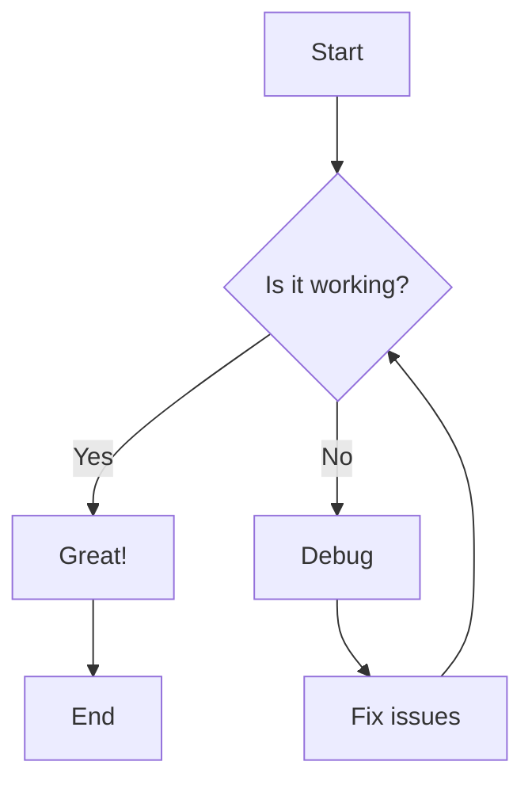
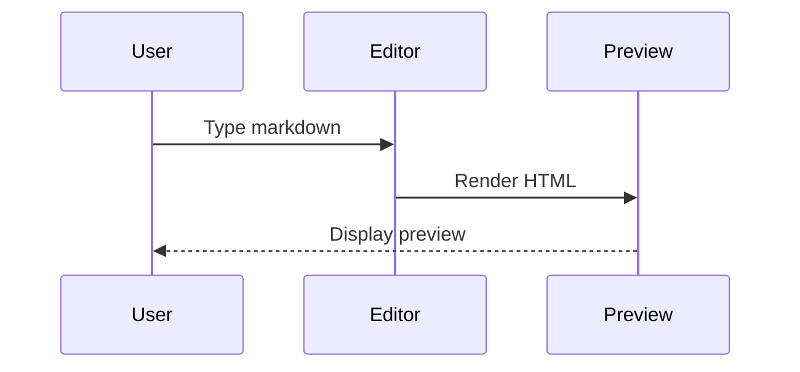
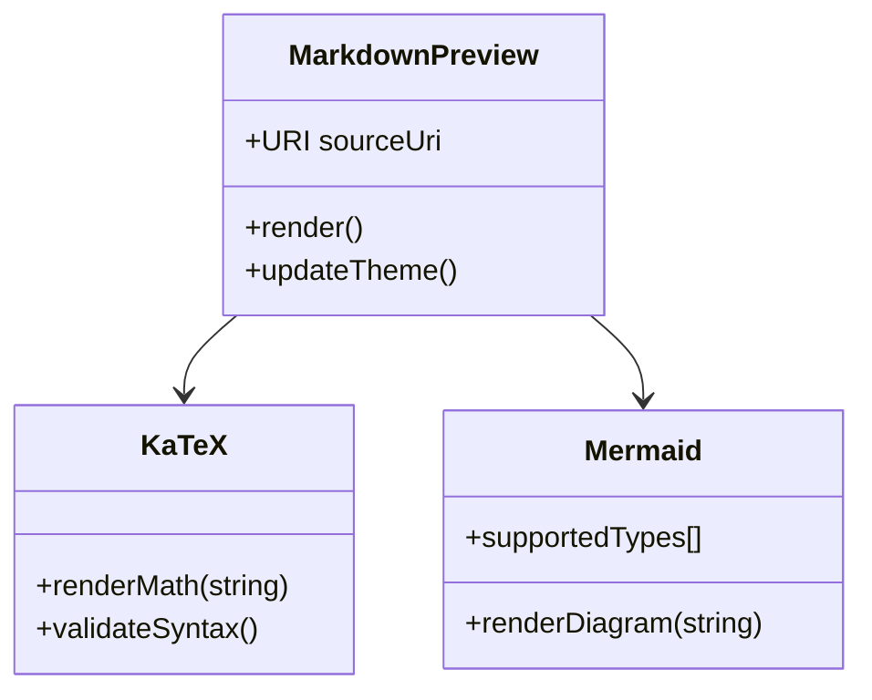

# Crow Markdown Preview Test

This is a **test document** to verify the markdown preview features including *KaTeX math*, `code blocks`, and ~~diagrams~~.

## Features

### Text Formatting
- **Bold text** and *italic text*
- `Inline code` with syntax highlighting
- ~~Strikethrough~~ text
- [Links to documentation](https://example.com)

### Code Blocks

```rust
fn main() {
    println!("Hello from Crow editor!");
    let x = 42;
}
```

```typescript
interface Config {
    theme: 'dark' | 'light';
    fontSize: number;
}
```

### Lists

1. First ordered item
2. Second item
   - Nested unordered
   - Another nested item
3. Third item

### Tables

| Feature | Status | Notes |
|---------|--------|-------|
| KaTeX | ✅ | Inline and display math |
| Mermaid | ✅ | Diagrams rendering |
| Code highlighting | ✅ | Multiple languages |
| Theme integration | ✅ | Uses workbench colors |

## Mathematics with KaTeX

Inline math: The formula $E = mc^2$ is famous.

Display math:

$$
\int_{-\infty}^{\infty} e^{-x^2} dx = \sqrt{\pi}
$$

Another equation:

$$
\nabla \times \vec{E} = -\frac{\partial \vec{B}}{\partial t}
$$

Complex fraction:

$$
f(x) = \frac{1}{\sigma\sqrt{2\pi}} e^{-\frac{1}{2}\left(\frac{x-\mu}{\sigma}\right)^2}
$$

## Diagrams with Mermaid

### Flowchart



### Sequence Diagram



### Class Diagram



## Blockquotes

> "The best way to predict the future is to invent it."
> 
> — Alan Kay

> Nested blockquotes work too:
>> This is nested
>>> And even deeper

## Horizontal Rule

---

## Task Lists

- [x] Implement KaTeX rendering
- [x] Add Mermaid support
- [x] Integrate workbench theme
- [ ] Add export to PDF
- [ ] Support custom CSS

## Edge Cases

### Long Lines
This is a very long line that should wrap properly in the preview without breaking the layout or causing horizontal scrolling issues in the rendered output when viewed in the Crow editor markdown preview pane that we built today.

### Special Characters
- Ampersand: &
- Less than: <
- Greater than: >
- Quotes: "test" and 'test'

### Empty Sections

#### Below this heading is nothing


#### Above this heading is nothing

## The End

This test document verifies:
1. ✅ Standard markdown rendering
2. ✅ KaTeX math (inline `$...$` and display `$$...$$`)
3. ✅ Mermaid diagrams (flowchart, sequence, class)
4. ✅ Code blocks with syntax highlighting
5. ✅ Theme integration with workbench colors
6. ✅ Proper spacing and padding
7. ✅ Links, emphasis, and formatting
8. ✅ Tables and lists
9. ✅ Blockquotes and horizontal rules

**Preview should scroll smoothly with adequate bottom padding!**
